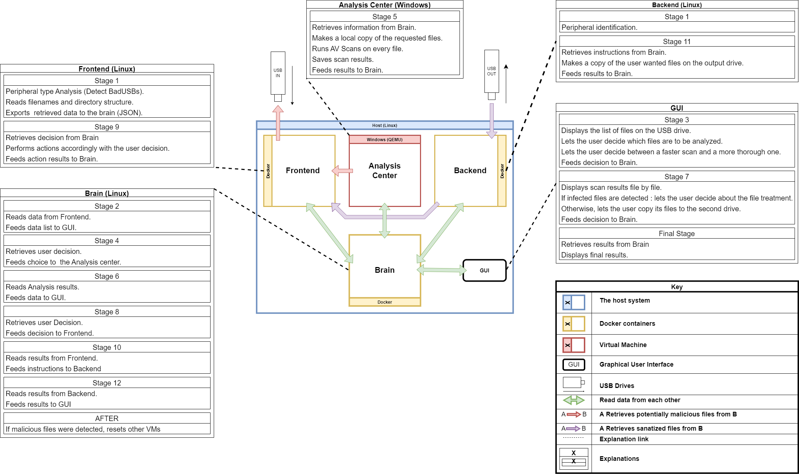
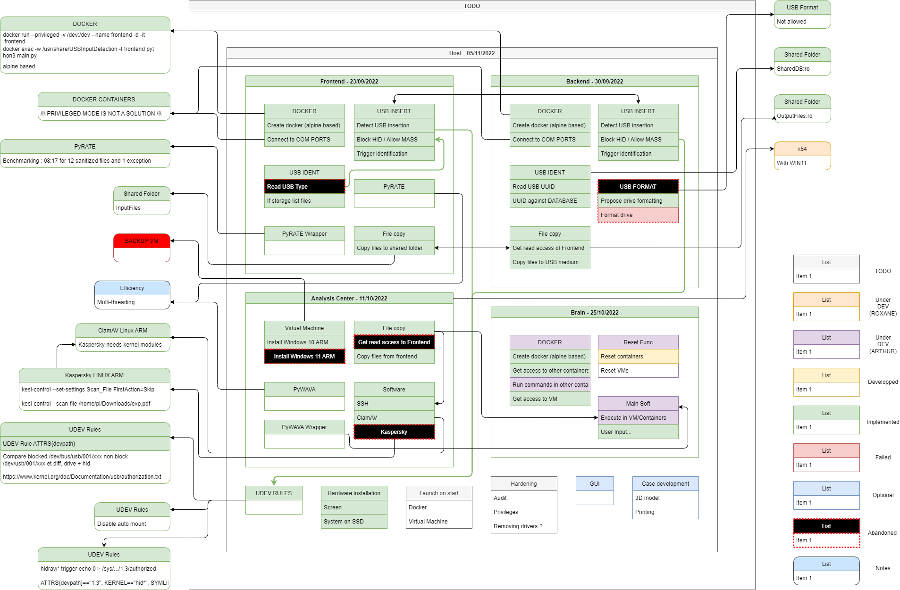

# Asterix (SANDBOX)

> Automated Sanitizing Terminal with Embedded Relevant Information eXtraction

## What is this repo ?

This project will be in active development from the 22nd of August 2022 until at least the 10th of November 2022.  
The ultimate goal is to propose an Open-Source USB malware cleaner kiosk that is portable and offers good functionalities.

This is my graduation project from the French Naval Academy, in collaboration with the Informatic Institute of the University of Amsterdam.

You will find here the pieces of software that make Asterix as well as the report concerning the project one redacted.  
You will also find functionnalities that have not been implemented but were part of the thinking/designing process.

## The project

#### System Components

- ✅ [Frontend](Frontend) :
    - [USB Handler](Frontend/USBHandler)
    - [Pyrate](https://github.com/G4vr0ch3/PyRATE)
    - [Pyrate Automation](Frontend/PyrateAutomation/)
- ✅ [Backend](Backend)
    - [USB Handler / Identification](Backend/USBHandler)
    - [USB to USB transfer](#)
- ✅ [Analysis Center](AC-Center)
    - [Virtual Machine](#)
    - [USB to VM transfer](#)
    - [Anti-Virus Analysis Wrapper PyWAVA](https://github.com/G4vr0ch3/PyWAVA)
    - [Pywava Automation](AC-Center/PywavaAutomation/)
- ❌ [Brain](Brain)
    - [Reset handler](#)
    - [MAIN](#)
- ❌ [Host](Host)
    - [Start launcher](#)
    - [UDEV Rules](#)

|  |
| :-: |
| System's architecture |

#### Project Status

| Item | Status | Completion | Comment |
| :-: | :-: | :-: | :-: |
| Frontend | :green_circle: | 100% | Done. |
| Backend | :green_circle: | 100% | Gave up on drive formatting. |
| AC-Center (ARM) | :yellow_circle: | 99% | SSH Identity. |
| AC-Center (x64) | :hourglass: | 0% |  |
| Brain | :green_circle: | 100% | Implementing ssh interraction with other containers ? |
| Host | :orange_circle: | 50% | Main soft/Hardening/GUI. |
| Installer | :orange_circle: | 70% |  |
| Hardware | :orange_circle: | 75% | Case. |
| [Website](https://g4vr0ch3.github.io/Asterix) | :orange_circle: | 15% | Under construction |

|  |
| :-: |
| Detailed status |

#### ANSSI Requirements compliance

| ID | ANSSI mandatory requirement item | Compliance | Precision |
| :-: | :-: | :-: | :-: |
| FS1 | Secure transfer of file(s): the product must allow the transfer of file(s) from a removable medium while guaranteeing the harmlessness of the medium and the files (the product must be designed in such a way that its integrity and operation cannot be altered by removable media or a file). The analysis of a file must not degrade the availability of the product. | :green_circle: | 95% |
| FS3 | Display of the list of file(s): the product must make it possible to list the content of the input media as well as that of the output for the selection of the files to be transferred and their verifications. | :green_circle: | 100% |
| FS5 | Security analysis: the product must carry out a systematic antiviral analysis of the files to be imported. | :green_circle: | 100% |
| FS6 | Encryption: the product stores the connection secrets of the administrators (No user authentication on the white station necessary). Authentication on the PID is carried out with the operational IS for the users. | :green_circle: | 100% |
| FS7 | Identification, authentication and access control: the product identifies and authenticates the administrators allowing to control the resources according to the rights of the latter. | :green_circle: | 100% |
| FS8 | Software integrity: the product makes it possible to update the software that constitutes it (operating system and specific software(s)). | :red_circle: | 0% |
| FS9 | Integrity of event logs: the product reports all operations performed by users and by itself (excluding file(s) transfer). | :orange_circle: | 30% |
| FS10 | Protection of flows: incoming and outgoing administrative flows of the product must be secured. | :yellow_circle: | 50% - Unchecked |
| FS11 | Partitioning: the business functions (administration, transfer, analysis, etc.) of the product are partitioned in order to limit remote control and the risk of rebound. | :green_circle: | 95% |
| FS12 | Sizing: the product must be correctly sized in order to take into account the constraints of transfer time, storage capacity, etc. | :green_circle: | 90% - Case design |
| FS13 | Integrity of incoming and outgoing media: the product must guarantee the integrity of inserted media, whether incoming or outgoing. | :green_circle: | 100% - Unchecked |
| FS14 | Product integrity: whatever the input or output medium, its insertion must not affect the integrity of the product. | :green_circle: | 100% - Unchecked |
| FS15 | Filtering in the case of a PID connected to a network: The product must protect direct access to the operational network from the PID. | :red_circle: | 0% - Disconnected |

#### Specification compliance

| ID | Specification item | Compliance | Precision |
| :-: | :-: | :-: | :-: |
| R1 | Our device must be as Open-Source as possible. | :green_circle: | 100% |
| R2 | Our device must meet the ANSSI requirements where possible. | :yellow_circle: | 70% |
| R3 | Our device must be easily operable. | :orange_circle: | 50% - Missing GUI |
| R4 | Our device must be able to protect itself from BadUSBs. | :green_circle: | 100% |
| R5 | Our device must be able to extract relevant data from corrupted files. | :green_circle: | 100% - For supported formats |
| R6 | Our device must operate completely offline. | :green_circle: | 100% - Unverified |
| R7 | Our device must be easily transportable. | :yellow_circle: | 70% - No case |
| R8 | Our device must be updatable using a trusted USB medium. | :red_circle: | 0% - Not implemented |

## Contributing to the project

We will gladly accept any valuable input !  
Should you have any remarks, advice or whatever you deem useful to us, please contact me either via:

> [e-mail](mailto:gavrochebackups@gmail.com)  
> [Discord](https://discordapp.com/users/Gavroche#2871)  
> [Twitter](https://twitter.com/Gvrch3)

Many thanks !

##

[Gavroche](https://github.com/G4vr0ch3)
